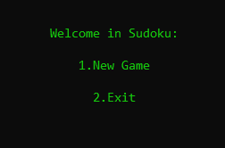
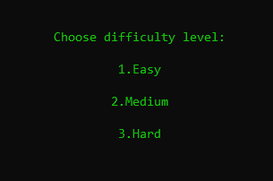
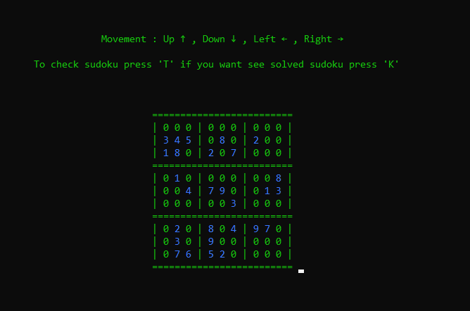

# Sudoku
Basically I use algorithm for generating the sudoku grid based on solving sudoku functions. Menu is simplified to two options as in a picture below

**Choosing option-** ***2.Exit*** you just leave program

**Choosing option-** ***1.New Game*** you may select difficulty 

At this point program starts to solve sudoku and with solved puzzle copy to other grid and deletes amount of numbers based on choosen difficulty 
also checking if grid is solvable.
Here we have random Sudoku to solve.

